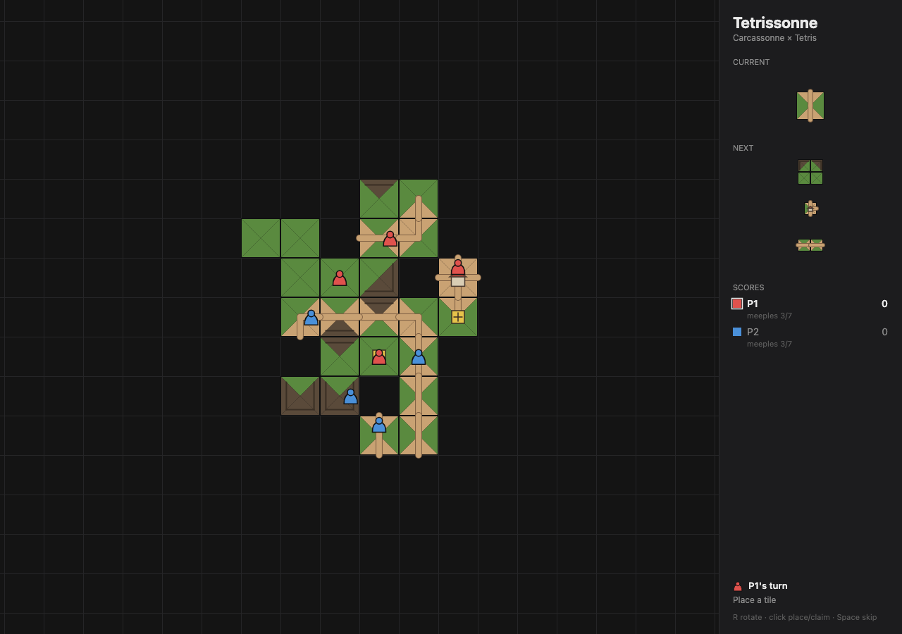
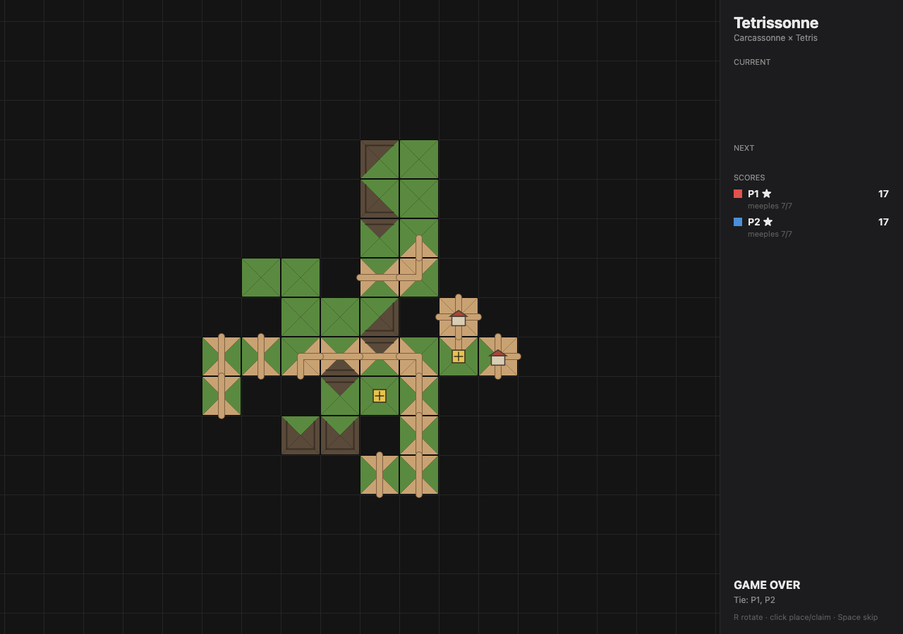

# Tetrissonne

A tile-laying game that mashes up **Carcassonne**'s feature-matching board with **Tetris**'s falling-shape twist. Land polyomino tiles onto the growing map so that roads, cities, and fields line up — and clear pressure by completing features before the queue overflows.



## Status

Playable prototype: lay tiles from a shuffled bag onto the board with strict edge-matching, claim roads, cities, monasteries, and fields with meeples, and score completed features during play and at the end of the game. Tetris-style queue pressure is still to come — see [docs/design.md](docs/design.md) for the roadmap (milestones M1–M5).

Two players take turns; each turn is place a tile, then optionally place one of your seven meeples on a feature of the tile you just laid. When a feature is completed it scores and its meeples return to their owners. At game over, incomplete features and fields score too.



## Controls

- **Mouse move** — preview placement (green ghost = legal, red = illegal)
- **Click** — place the current tile, then click a feature to claim it with a meeple
- **R** / **E** — rotate clockwise · **Shift+R** / **Q** / right-click — rotate counter-clockwise
- **Space** — skip placing a meeple

## Rules so far

- The starter tile is placed at the origin.
- Every subsequent tile must (a) not overlap, (b) touch at least one existing cell, and (c) match feature type on every touched edge — road↔road, city↔city, field↔field.
- Polyomino tiles (dominoes, L/S/I trominoes, an O-shaped city) place all their cells in one action, so a legal spot has to satisfy the match rule on every touched edge at once.
- After placing a tile you may drop one meeple on an unclaimed road, city, monastery, or field on it. Completing a feature scores it and frees the meeples that were on it; roads, cities, monasteries, and fields all score at game over as well.

## Stack

- **TypeScript** — game logic and rendering
- **Vite** — dev server and bundler
- **HTML5 Canvas** — 2D rendering surface
- **Vitest** — unit tests for board rules and scoring

The stack is a placeholder; if it makes more sense to migrate to Phaser, PixiJS, Godot, or Unity as the design settles, we will.

## Getting started

```bash
npm install
npm run dev
```

Then open the URL Vite prints (usually `http://localhost:5173`).

Other scripts:

```bash
npm run build     # production build to dist/
npm run preview   # serve the production build locally
npm run test      # run unit tests
npm run typecheck # tsc --noEmit
```

## Layout

```
src/           game code
  core/        rules engine (board, tiles, scoring) — no rendering
  render/      canvas rendering
  input/       pointer / keyboard input
  ui/          menus, HUD
tests/         vitest suites mirroring src/
docs/          design docs, notes
public/        static assets served as-is
```

## License

TBD.
